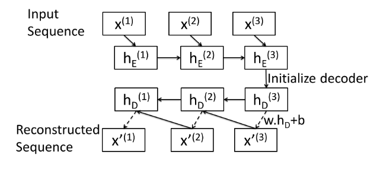
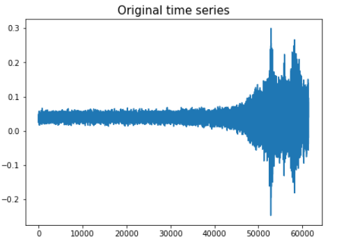
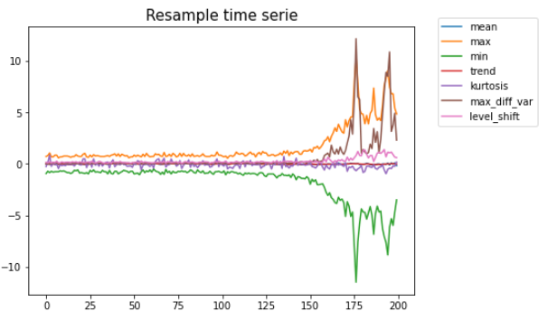
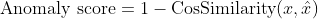

# LSTM AutoEncoder for Anomaly Detection

The repository contains my code for a university project base on anomaly detection for 
time series data.

The data set is provided by the Airbus and consistst of the measures of the accelerometer 
of helicopters during 1 minute at frequency 1024 Hertz, which yields time series measured 
at in total 60 * 1024 = 61440 equidistant time points.

The data was composed of 1677 and 2511 time series respectively for training and testing 
our model. The training data contains no anomaly. The metric of the challenge was AUC. 

## Model
My approach was to implement a LSTM AutoEncoder, following the architecture of those paper: 

- <a href='https://arxiv.org/pdf/1607.00148.pdf'>LSTM-based Encoder-Decoder for Multi-sensor Anomaly Detection [1] </a>
- <a href='https://export.arxiv.org/pdf/1711.10192'>Using LSTM Encoder-Decoder Algorithm for Detecting Anomalous ADS-B Messages [2]</a>

The idea is to use two lstm one encoder, and one decoder, but the decoder start at the end of the 
sequence and tries to recreate the original sequence backward. 

</img>

## Preprocessing
Before implementation in order to have a lower computation cost, preprocessing was applied on each time series:
- Scaling of the time serie
- Sampling of the ts in order to reduce its dimension from 64000 to 200
- In order to keep information multiple transformation was applied during the resampling operation transforming the problem in a multivariate 
time serie anomaly detection

    Transformation applied:
        - mean, max, min, trend, kurtosis, level_shift (difference beetween consecutive mean), max_diff_var (maximum var difference of sliding window of 24)
      
</img>
</img>

Then those time series where split in sequence of size 50 with a moving window of step 30. Giving a training, validation and test set of 8049, 2013, and 15066 sequences respectively.

## Anomaly score and optimization
Once training is done we can find the set of ts the one that are failed to be reproduce, and so they can be labelled as anomaly. In order to calculate this anomaly score, the following the paper <a href='https://export.arxiv.org/pdf/1711.10192'>[2] </a> use the cosinus similarity was used and average over the sequences:

</img>

The anomaly score was kept for each transformation which gave a 7 dimensional vector. Then those vector were used to train a Isolation Forest and to have the final anomaly scores.

With this approach 0.79 AUC score was achieved.

To push to this score varying techniques was tested on the model. 
 - The size of the hidden space: 300 dimension was used
 - The learning rate 0.001 with the implementation of the reduction on plateau (after a chosen patience)
 - The batch size, smaller batch size of 32 seemed to give access to better minima (probably a tradeoff with the learning rate) 
 - The initialisation of the hidden state is random. To have general idea of the anomaly score a mean on 10 prediction were made before calculating the score. 
 
## Additional features
To further push this score additional feature calculated on the global time serie was made.
Iterative additional feature were tested and kept if the score improved. In order to used our prediction error here the mean of each sequence gave better result than the cosinus similarity.
To choose those feature the paper <a href='https://dl.acm.org/doi/abs/10.1145/2783258.2788611'>Generic and Scalable Framework for Automated Time-series Anomaly Detection [3]</a> was studied and the R librairy <a href='https://pkg.robjhyndman.com/tsfeatures/articles/tsfeatures.html'>tsfeatures</a> was used with the <a href='https://rpy2.github.io/doc/v2.9.x/html/index.html'>Rpy2</a> package.

A total of 10 features was kept: autocorrelation, skew, mean, crossing_points, flat_spots, hurst, spike, curvature, nonlinearity, diff1_acf10 (see tsfeatures link for details one the features)

The score was once again calculated with Isolation forest (other algorithms gaved significally lower scores), the final score reach was 0.833503281545

## Further Improvement
The iterative method used in second part is far from optimal and a process that could automate this will be 
to follow the indication of the <a href='https://cs.nju.edu.cn/zhouzh/zhouzh.files/publication/icdm08b.pdf'> 
Isolation Forest paper</a>.  The authors recommend to use an additional Kurtosis test (that gives information 
the presence potential anomaly in regards to the distribution of the data) on sampled data to rank and choose
a subspace of feature for each new tree. 

This feature seemed interesting since it would then be possible to add all the feature created and the algorithm 
will choose by itself the ones that are more promising to highlight anomaly. 

I did not have time to implement this solution a PR has been made to include this feature, and it might be available 
in the future. You can find the PR <a href='https://github.com/scikit-learn/scikit-learn/pull/11915'>here</a> 
